# После 45: маршрут до 2200 GS, крафт, арканы и энергия

Разбор видео TitanTheF от 03.10.2026. Текст проверен 03.10.2026. Неофициальный гайд.

[Исходное видео](https://www.youtube.com/watch?v=hUk7jO3jUdw) · [Исходная таблица](https://docs.google.com/spreadsheets/d/e/2PACX-1vQ0C3iKFteGvIbgqNDnQq7bmwIaU23DvjbPa0HPSVAdOOiCeBkEq69Cn8jVMJhToJcztCRylYeTYfOk/pubhtml)

Показанные цены, лимиты, рецепты и названия относятся к версии игры в ролике. Скриншоты открываются на сайте в полном размере.

## 01. Маршрут после 45 уровня

Закрывай пробелы в экипировке и открывай следующий порог подземелий.

### Начни с карты и оставшихся заданий

[Момент в видео](https://www.youtube.com/watch?v=hUk7jO3jUdw&t=37s)

GS — показатель снаряжения, по которому игра проверяет доступ к активности. Он помогает открыть подземелье, но сам по себе не описывает урон, выживаемость и качество билда.

После 45 уровня проверь сюжетные задания, зелёные задания, точки исследования и очки Даэваниона. Автор показывает персонажа асмодиан в Альтгарде: для другой фракции ориентируйся на те же типы задач на своей карте.

1. Открой карту и выбери область. Посмотри список исследования слева и незакрытые отметки.
2. Наведи курсор на интересующую область, чтобы увидеть её прогресс. У автора часть областей уже закрыта на 100%.
3. Заверши доступные сюжетные и зелёные задания. Не пропускай награды только потому, что достиг 45 уровня.
4. Проверь доступные очки Даэваниона и вложи их в свою ветку. Точное количество зависит от выполненных задач.

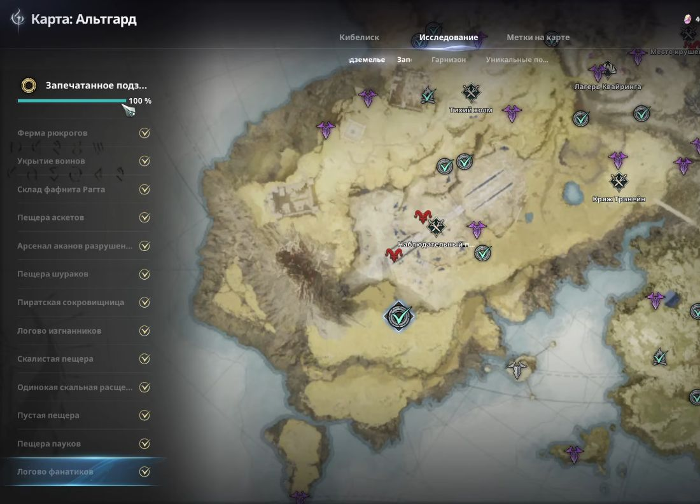

Карта Альтгарда: прогресс исследования вынесен в список слева.

### Получи первую золотую экипировку

[Момент в видео](https://www.youtube.com/watch?v=hUk7jO3jUdw&t=98s)

**Где открыть:** Экспедиция → Исследование → Драупнир

В режиме «Исследование» автор показывает выбор золотого предмета Бакармы из гарантированной награды. Такой выбор помогает закрыть конкретный пустой или слабый слот. Сначала прочитай условия гарантии в своём окне: награда и счётчик относятся к выбранному режиму.

Его начальный ориентир усиления: золотая броня до +5, оружие и Guard до +10. Guard — отдельный предмет рядом с оружием; название в переводе клиента может отличаться. Это практический пример автора, а не обязательное условие для каждого класса.

1. Выбери именно режим «Исследование», затем Драупнир.
2. Открой значок гарантированной награды и посмотри, какие предметы разрешено выбрать.
3. Выбери улучшение для слабого слота, затем усили его в пределах своего запаса ресурсов.
4. После замены предмета снова посмотри GS: если следующий порог уже открыт, не трать всё на промежуточную вещь.

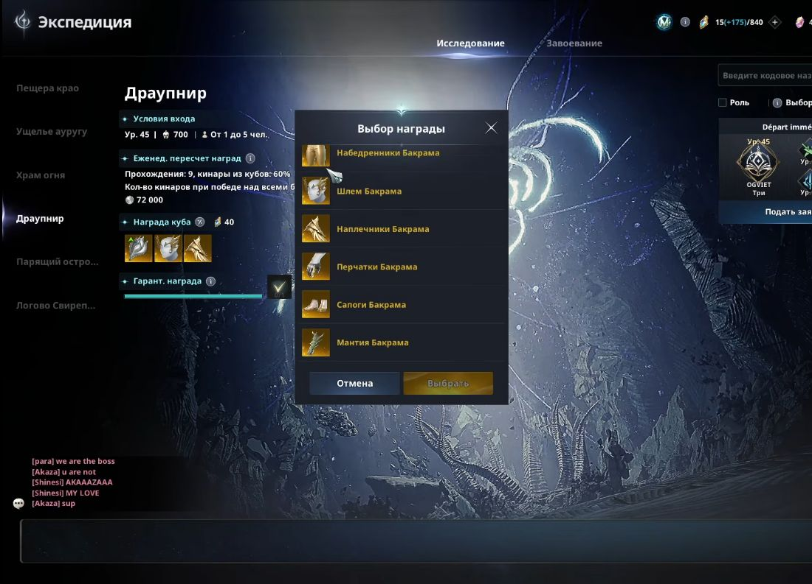

Драупнир: окно выбора гарантированной золотой награды. Проверяй режим и предмет до подтверждения.

### Если немного не хватает GS: камни маны, украшения и перья

[Момент в видео](https://www.youtube.com/watch?v=hUk7jO3jUdw&t=134s)

**Где открыть:** Усиление → Камни маны

Автор заполняет доступные слоты камнями маны и старается получить несколько зелёных строк характеристик. У простого камня тип и величина эффекта случайные. Новая попытка заменяет текущий набор эффектов — это не бесплатное добавление ещё одной строки.

Украшения в начале он усиливает хотя бы до +5. Предмет из сюжета может пока оставаться полезным: сравни фактические характеристики, а не только цвет рамки.

Ещё один источник небольшого прироста — перья в Бездне и вложение полученных очков в связанную ветку Даэваниона. Автор оценивает свой прирост примерно в 20–30 GS; твой результат зависит от уже собранных точек и вложенных очков.

**Не меняй хороший эффект вслепую.** Перед расходом камня прочитай предупреждение о замене характеристик. Цвет строки и GS не заменяют проверку полезности эффекта для твоего класса.

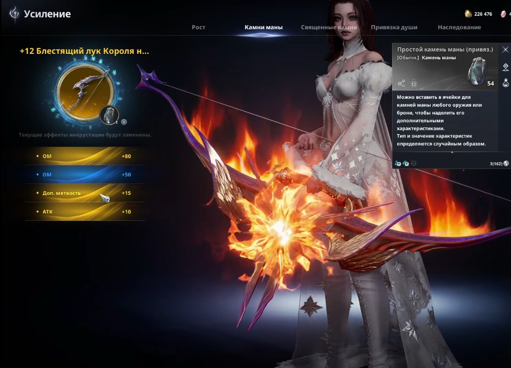

Подсказка простого камня маны справа: случайные эффекты и замена текущих характеристик.

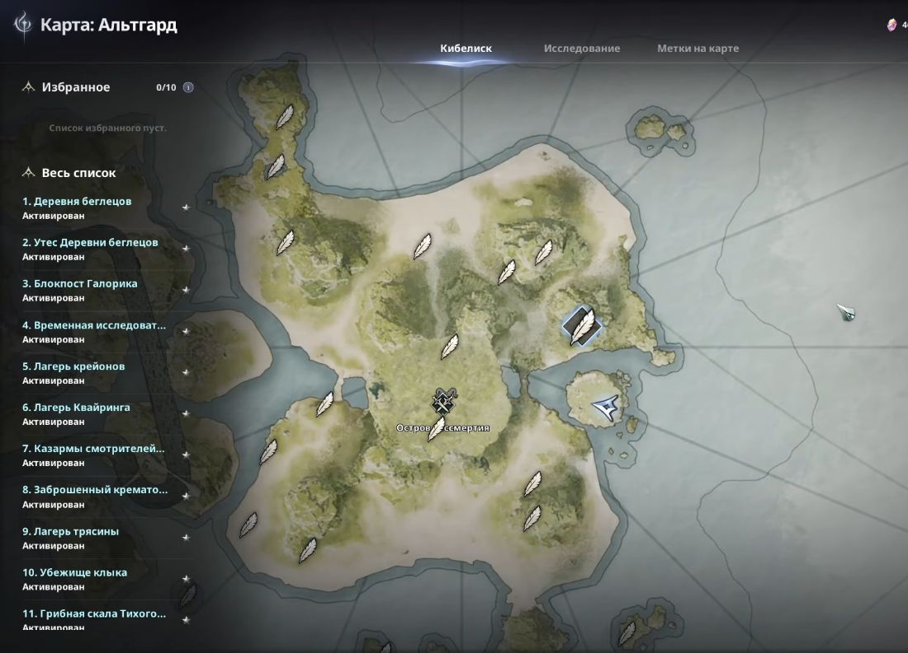

Карта Бездны из ролика: автор указывает на сбор перьев как дополнительную часть прогрессии.

### 1400 GS: переходи в «Завоевание»

[Момент в видео](https://www.youtube.com/watch?v=hUk7jO3jUdw&t=233s)

**Где открыть:** Экспедиция → Завоевание

На этом этапе в ролике фигурируют «Ущелье ауруру» и «Парящий остров Вакрона». У выбранного острова в интерфейсе указан вход с 1400 GS. Здесь автор добирает золотые предметы и использует гарантии, чтобы уменьшить зависимость от случайного выпадения.

Если порог ещё закрыт, можно добрать недостающие предметы в предыдущем доступном подземелье. Но расходуй энергию под конкретную цель: бесконечно повторять старую активность после открытия новой обычно не требуется.

1. Сравни награды двух доступных подземелий со своими слабыми слотами.
2. Проверь стоимость входа, получения награды и условия гарантии.
3. Выбирай гарантированный предмет в незакрытый слот. Случайный дроп может изменить твой план.
4. Следи за своим счётчиком гарантии. Рассказ автора о числе его заходов не задаёт одинаковое число проходок для всех.

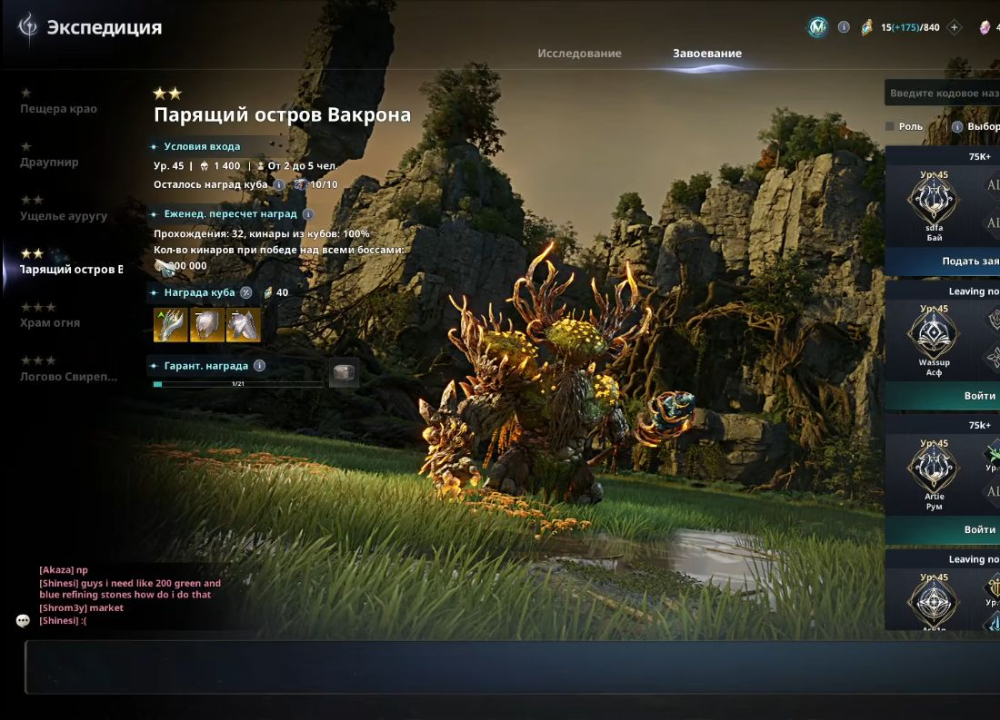

Парящий остров Вакрона в «Завоевании»: требование 1400 GS и отдельный счётчик гарантированной награды.

### 1600 GS: открой первый этап «Возвышения»

[Момент в видео](https://www.youtube.com/watch?v=hUk7jO3jUdw&t=259s)

**Где открыть:** Экспедиция → Возвышение

На первом этапе «Расколотого Арканиса» и «Исследовательской базы Деус» автор показывает требование 1600 GS. Это точное название раздела в показанном интерфейсе: «Возвышение».

Арканы дают характеристики и дополнительные уровни навыков. В начале смотри на пользу конкретного навыка, а не пытайся сразу собрать идеальный комплект. Для лучника автор выделяет «Скоростную стрельбу» и «Прицельный выстрел». Для другого класса эти приоритеты переносить нельзя.

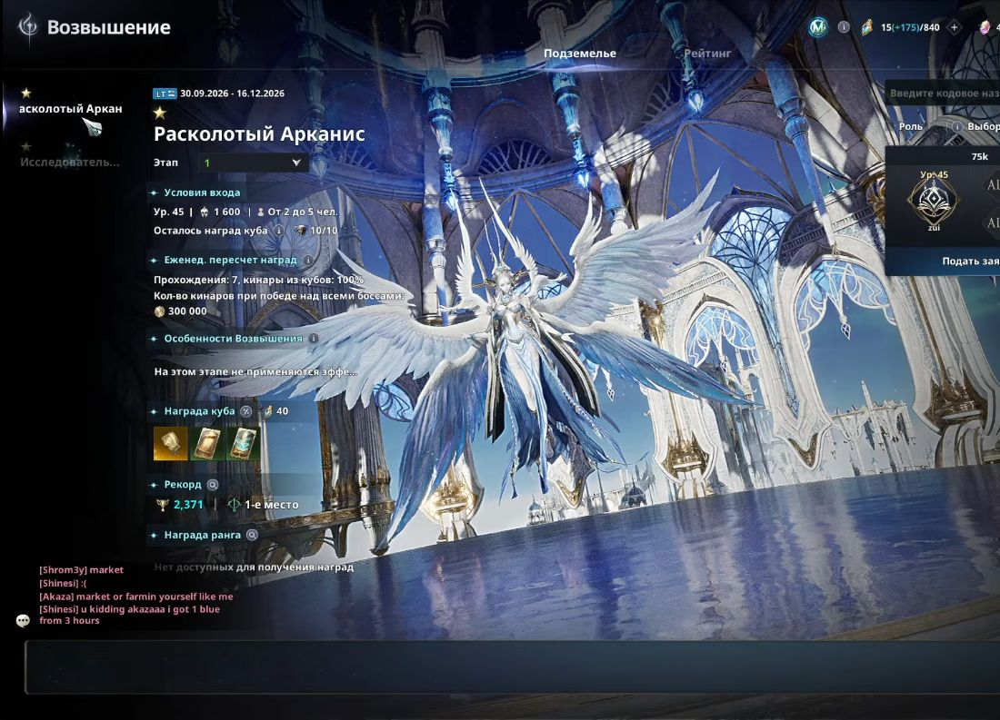

Расколотый Арканис, этап 1: в окне входа указано 1600 GS.

### 1900 GS: второй этап и точечная замена предметов

[Момент в видео](https://www.youtube.com/watch?v=hUk7jO3jUdw&t=334s)

Промежуточный прирост автор получает за счёт усиления, камней, аркан и закрытия оставшихся слотов. Если один предмет заметно отстаёт, проверь гарантированную награду нужного режима «Исследования», вместо того чтобы случайно фармить всё подряд.

Второй этап «Расколотого Арканиса» на экране требует 1900 GS. Автор идёт туда за следующими арканами. Выбери именно второй этап: требования разных этапов отличаются.

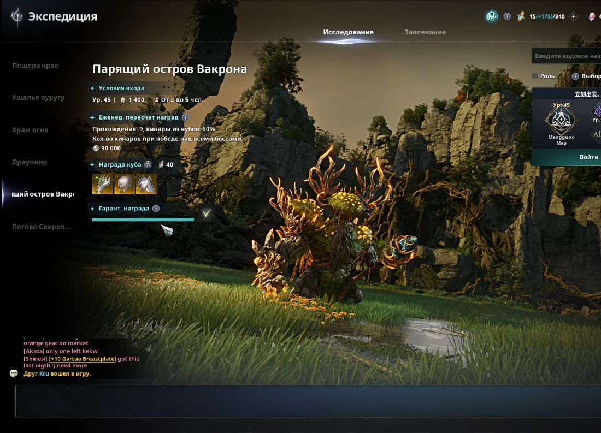

Исследование Парящего острова Вакрона: гарантия помогает выбрать недостающий предмет.

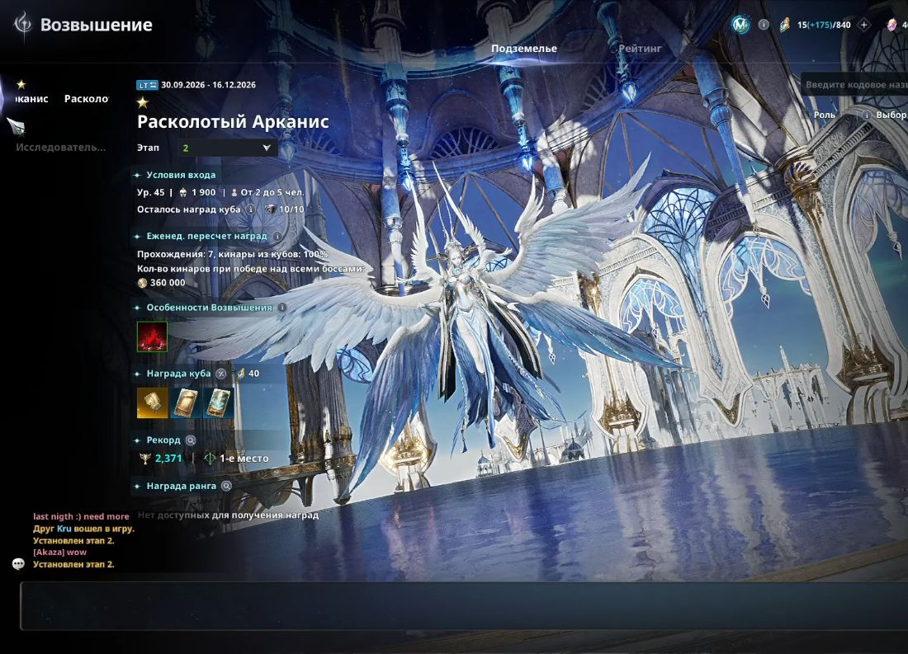

Расколотый Арканис, этап 2: требование 1900 GS.

### 2100 GS: новые подземелья; 2200 — следующий этап Арканиса

[Момент в видео](https://www.youtube.com/watch?v=hUk7jO3jUdw&t=788s)

Автор говорит о переходе к «2к», но в меню «Логова Свирепого Рога» видно 2100 GS. У показанного «Храма огня» также 2100. Для планирования входа используй число в интерфейсе, а не округление из речи.

На третьем этапе «Расколотого Арканиса» показано 2200 GS. Не считай автоматически, что у других подземелий третьего этапа такой же порог: проверяй выбранную активность отдельно.

Достигнув порога, оцени готовность персонажа: полезные эффекты, навыки, усиление и механики боя. Погоня только за цифрой может дать доступ к входу без достаточной силы для прохождения.

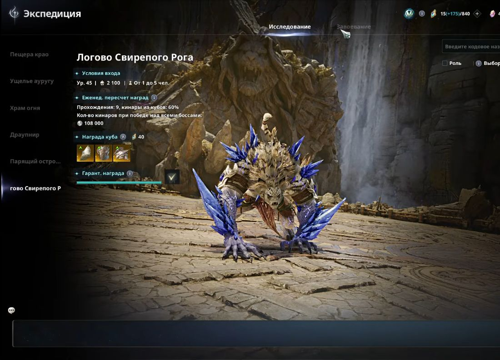

Логово Свирепого Рога: на экране 2100 GS, хотя в речи автор округляет порог до «2к».

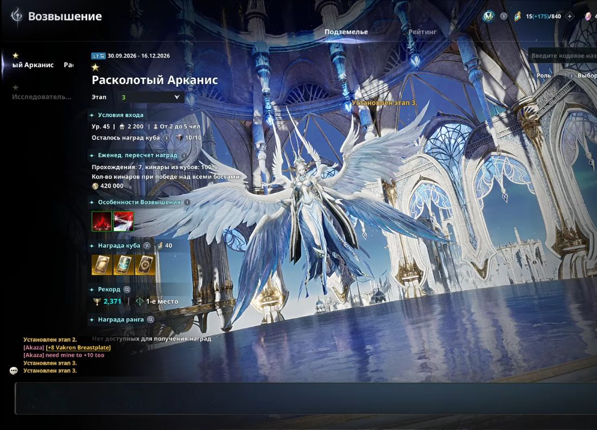

Расколотый Арканис, этап 3: 2200 GS.

## 02. Где добрать ресурсы и GS

Кристаллы, задания и руны: проверяй награду и цену до покупки.

### Кристаллы Даэваниона в магазине фестиваля

[Момент в видео](https://www.youtube.com/watch?v=hUk7jO3jUdw&t=413s)

**Где открыть:** Фестиваль Шуго → Магазин фестиваля → Рост

Нужный предмет — «Кристалл Даэваниона (привяз.)». Он расходуется на развитие соответствующей системы. Покупка кристалла сама по себе не означает, что очки уже вложены: после получения открой Даэванион и проверь доступное развитие.

Автор рассказывает о покупке 32 кристаллов и своём приросте GS. На скриншоте видна ступенчатая покупка: этапы имеют разные цены и квоты. Сначала посчитай стоимость доступного тебе количества; не воспринимай 32 как обязательный или гарантированно доступный запас.

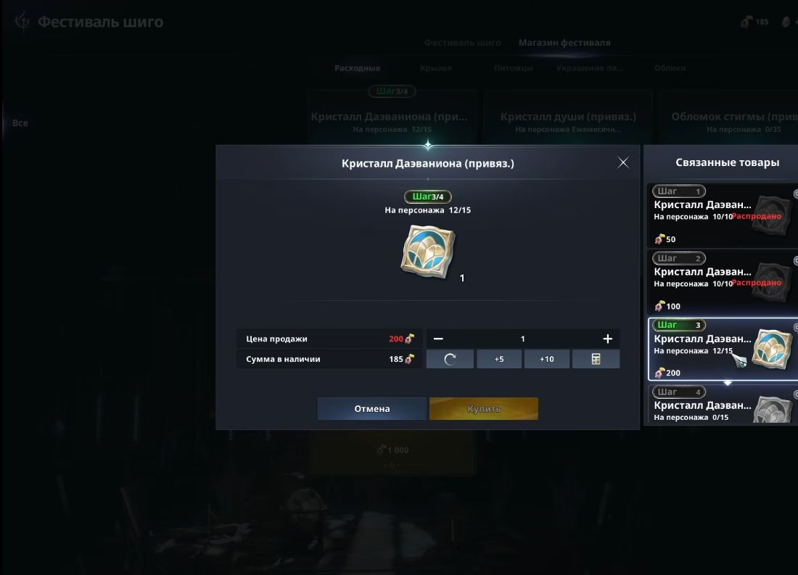

Кристалл Даэваниона в фестивальном магазине: у покупки несколько ступеней с отдельными лимитами.

### Выбирай задания по наградам, а не только по названию

[Момент в видео](https://www.youtube.com/watch?v=hUk7jO3jUdw&t=447s)

**Где открыть:** Журнал → Призвание → Миссии

В списке заданий отдельно показаны базовые и случайные награды. В строке случайной награды может быть от одного до пяти предметов. Наличие ключа или билета среди значков не обещает его получение за каждое выполнение.

Автор обращает внимание на билеты, ключи Шуго и ресурсы развития. Чтобы понять, выгодно ли конкретное задание, открой подсказку предмета и информацию о вероятностях, прочитай условия задания и сравни затраты.

Обновление списка платное: на показанном экране указано 35 000. Повторные обновления тоже расходуют валюту. Не обновляй бесконечно ради одного редкого значка.

1. Открой выбранную миссию и прочитай цель: куда идти и что требуется сделать.
2. Раздели базовую награду и список возможных случайных предметов.
3. Посмотри вероятность нужной награды через доступную в интерфейсе подсказку.
4. Перед обновлением проверь цену и свой остаток валюты.

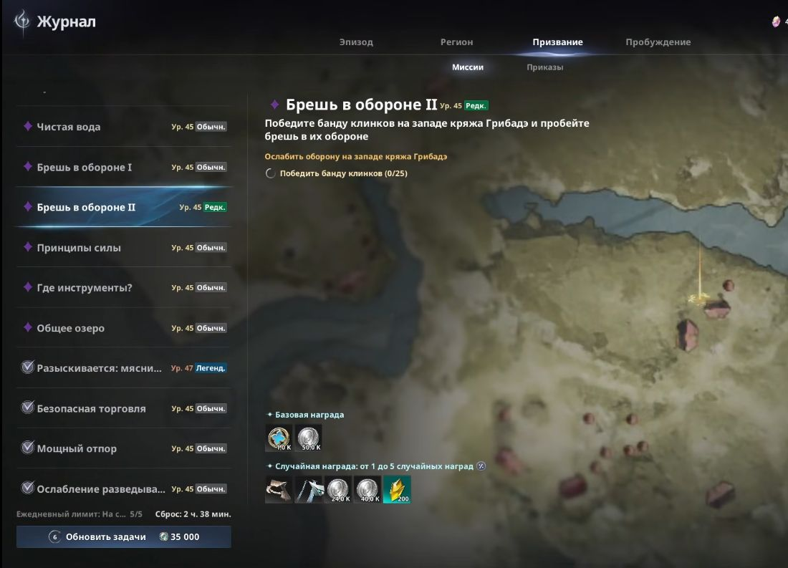

Миссии: базовая награда, случайная награда и стоимость обновления — три разных пункта.

### Верни руны, если потратил их раньше

[Момент в видео](https://www.youtube.com/watch?v=hUk7jO3jUdw&t=512s)

**Где открыть:** Кошмары → Магазин обмена → Рост

Если руны ушли в преобразование и нужных больше нет, автор предлагает проверить оставшиеся зелёные задания и магазин Кошмаров. В магазине показан «Сундук рун столкновения (привяз.)». Перед обменом прочитай состав сундука, стоимость и лимит.

Предмет из подсказки называется «Руна столкновения». Это отдельная система усиления, а не камень маны для экипировки. Также в магазине виден кристалл Даэваниона.

Следующий личный ориентир автора: корона +5, украшения и руны +10. Применяй его с учётом цены и доступных ресурсов; он не означает, что каждый предмет обязательно нужно улучшить до этих значений до следующего входа.

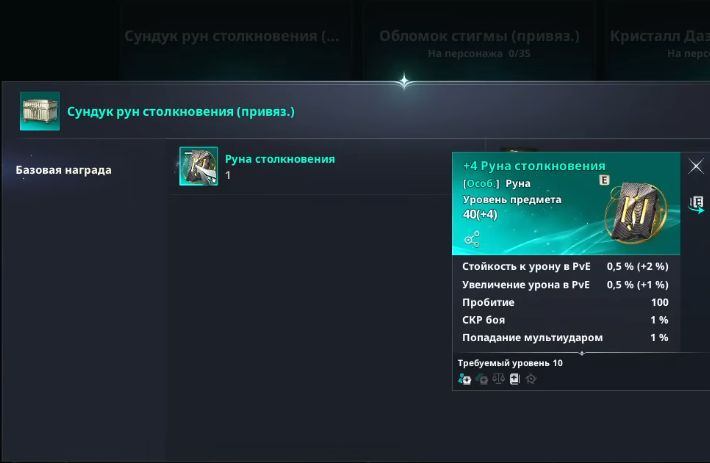

Сундук рун столкновения и подсказка руны в магазине Кошмаров.

## 03. Крафтовое оружие без лишних потерь

Разбери рецепт, вероятности и цепочку наследования до расхода дорогих материалов.

### Зачем автор выбрал крафтовый лук

[Момент в видео](https://www.youtube.com/watch?v=hUk7jO3jUdw&t=1299s)

Автор использует «Блестящий лук Короля неборожденных драконов». Его доводы: дополнительные строки характеристик, возможность подобрать полезные эффекты и дальнейшая цепочка создания оружия через наследование.

В качестве желаемого эффекта он называет боевую скорость, но на показанном луке её ещё нет. Сам автор говорит, что сборка не закончена. Покупать или создавать тот же предмет исключительно из-за ролика не требуется.

Сравниваемые в видео луки усилены по-разному. Их диапазоны атаки нельзя превратить в честный вывод о превосходстве одного предмета по общему урону. Сравнивай одинаковые условия, полезные характеристики и полную стоимость доведения предмета.

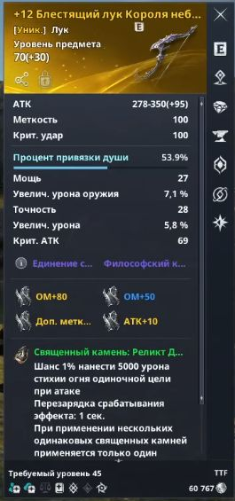

Фактический лук автора: пять строк характеристик. Боевой скорости в показанном наборе нет.

### Открой рецепт и разверни вложенные материалы

[Момент в видео](https://www.youtube.com/watch?v=hUk7jO3jUdw&t=840s)

**Где открыть:** Создание → Ювелирное дело → Лук

Для показанного лука используется ювелирное дело. Вложенная заготовка — самостоятельный этап: её материалы не равны полному списку ресурсов для готового оружия. Значки рядом с названием рецепта позволяют раскрыть эту цепочку.

В раскрытой ветке видно 5 плавильных камней, 8 единиц чистой асватовой древесины и 4 единицы чистого эфира. Это ресурсы одной показанной заготовки, а не универсальный рецепт всего лука. Другие ветки и верхний рецепт требуют дополнительные предметы.

Разговорное «сопли» в речи автора относится к показанным материалам подземелий. Для покупок используй название из подсказки конкретного значка: сходный цвет не означает одинаковый ресурс.

1. Выбери нужный лук и проверь требуемый уровень профессии.
2. Разверни каждую отсутствующую заготовку. Запиши материалы отдельно для каждого этапа.
3. Наведи курсор на каждый ресурс: сравни полное название, качество и привязку.
4. Учитывай, что промежуточное создание может не дать нужный результат с первой попытки. Одного набора материалов может не хватить.
5. Сравни цену готовой заготовки на рынке с затратами на повторные попытки.
6. Создавай в безопасном месте: интерфейс предупреждает, что атака прервёт создание, а материалы будут потрачены.

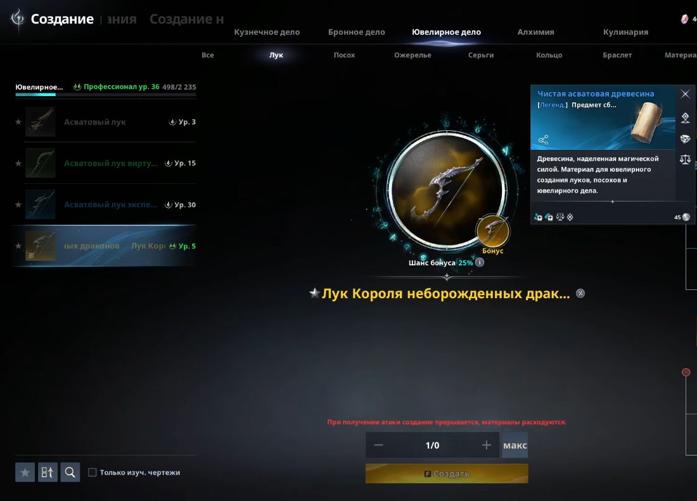

Рецепт лука: профессия автора «Профессионал 36», требование рецепта «Профессионал 5» и предупреждение о прерывании.

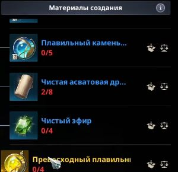

Увеличенная ветка материалов одной заготовки: количества 5, 8 и 4. Верхний рецепт требует и другие ресурсы.

### Как читать шанс: исправление расчёта из ролика

[Момент в видео](https://www.youtube.com/watch?v=hUk7jO3jUdw&t=989s)

Автор рекомендует поднять профессию примерно до «Профессионала 30» перед дорогим крафтом. На его примере уровень 36, требование рецепта 5: разница 31. При этом допуск к рецепту и шанс успешного результата — разные вещи.

В окне «Шанс создания» для разницы 31 показано 90,594902% в колонке базового создания. Автор предполагает, что это число нужно разделить на десять и прибавить к базовым 70%. Официальное описание NC объясняет иначе: таблица уже содержит итоговую вероятность с учётом рецепта и разницы уровней.

Создание накапливает отдельные шкалы успеха и провала. На каждом ходе независимо определяется результат; какая шкала первой достигнет цели, такой будет итог. Требования рецепта и уровень профессии влияют на этот процесс. Процент из таблицы не является дополнительными процентными пунктами.

У официального рецепта 진룡왕의 활 при разнице 31 указаны 90,594902% для обычного создания, 25% запуска комбо и 95,320780% успешного завершения комбо. Запуск комбо и его завершение — разные этапы. Это не основание складывать 25 и 9,5 и обещать 34,5%.

Официальная таблица относится к своей версии игры. Перед расходом ресурсов проверяй шанс именно своего рецепта в своём клиенте: совпадение показанного примера не делает одинаковыми все рецепты и регионы.

**Не считай попытку гарантированной.** Высокий шанс не равен 100%. Неудача и отсутствие нужного комбо могут потребовать новой заготовки и новых материалов. Заранее установи предел расходов.

[Официальное описание NC и таблица вероятностей создания](https://probability.plaync.com/aion2/view?probCategoryId=6a5f25e59bb1696f4bf77317)

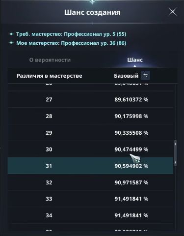

Шанс создания из ролика: строка с разницей 31 показывает 90,594902%. Это не прибавка +90%.

### Сравни древесину с преобразованием эфира

[Момент в видео](https://www.youtube.com/watch?v=hUk7jO3jUdw&t=924s)

**Где открыть:** Преобразование веществ → Предмет сбора

Автор показывает преобразование «Эфира высокой чистоты» в «Асватовую древесину высокой чистоты (привяз.)». На экране требуется одна единица эфира для одной единицы древесины, шанс 100%.

Это может быть дешевле покупки готовой древесины, если текущая цена подходящего эфира ниже. Пример цен из видео — историческая ситуация, а не обещание сегодняшней экономии.

Обрати внимание на качество и привязку: древесина высокой чистоты не является чистой или сияющей древесиной. Результат показанного преобразования привязан. Проверь, принимает ли именно его нужный рецепт; не рассчитывай перепродать его как свободный ресурс.

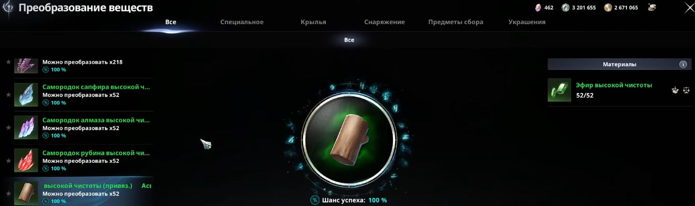

Одна единица эфира высокой чистоты → одна привязанная асватовая древесина высокой чистоты, 100%.

### Пример сбора древесины в Альтгарде

[Момент в видео](https://www.youtube.com/watch?v=hUk7jO3jUdw&t=1222s)

Автор показывает маршрут асмодиан вокруг Леса очищения в Альтгарде. Начало — район водоёма западнее леса; затем он ведёт курсор через лес к северо-восточной области рядом с Ущельем ауруру. Для возврата использует телепорт юго-восточнее леса.

Это ориентиры из движения курсора, а не точные координаты всех точек сбора. Смотри наличие ресурсов на своей карте и при необходимости меняй петлю. Для другой фракции нужен маршрут на её территории.

Рассказ о примерно 200 единицах за час относится к личному сбору автора при небольшой конкуренции. Плотность игроков и доступность точек меняют результат.

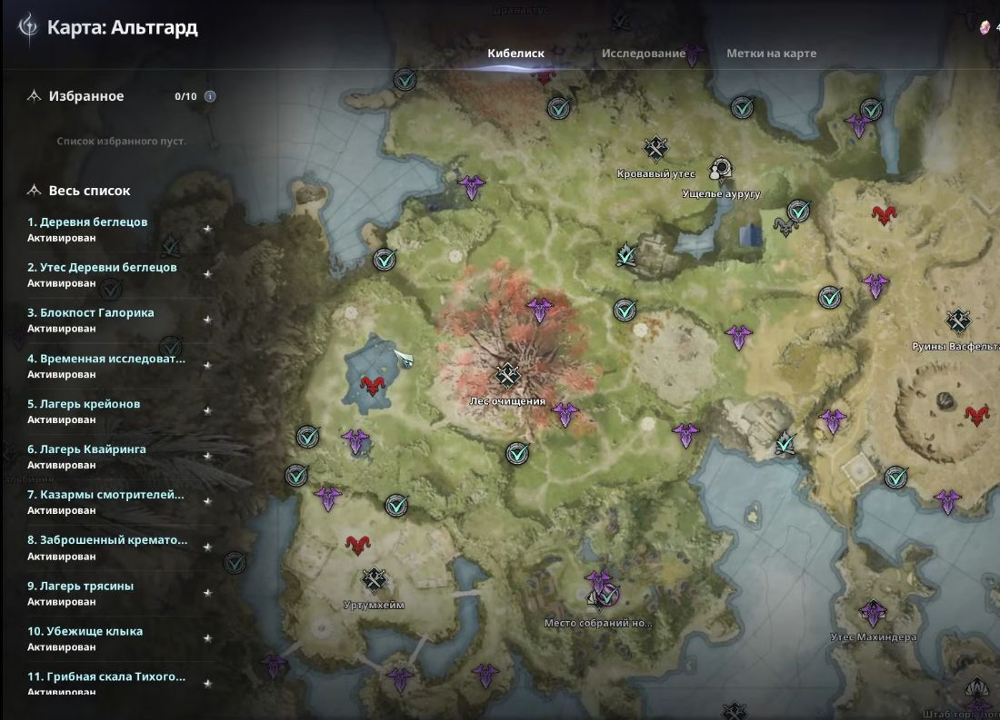

Ориентир начала: водоём западнее Леса очищения.

Автор ведёт маршрут к северо-востоку, в направлении Ущелья ауруру.

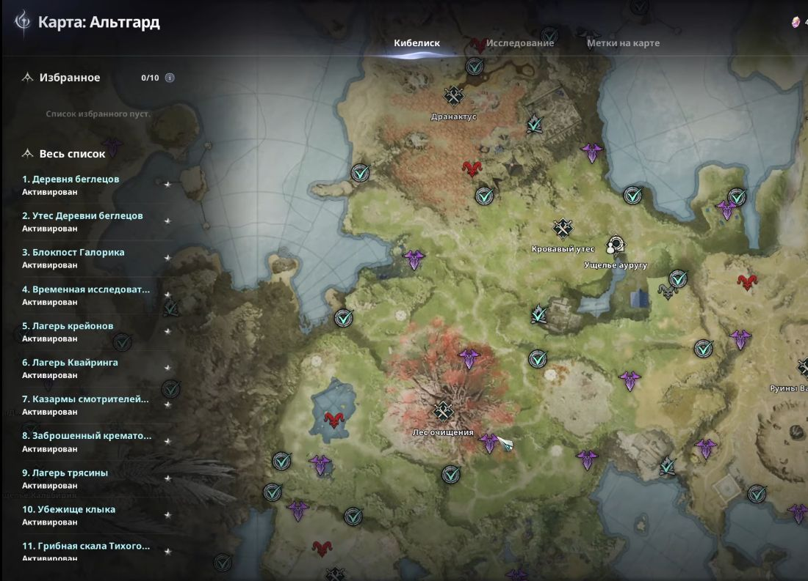

Возврат к началу петли: автор указывает на телепорт юго-восточнее леса.

### Подбери исходные строки, затем улучшай привязку души

[Момент в видео](https://www.youtube.com/watch?v=hUk7jO3jUdw&t=627s)

**Где открыть:** Усиление → Привязка души

Автор советует сначала получить подходящий набор характеристик через Книгу души, а затем вкладывать материалы в развитие привязки души. Смысл порядка — не расходовать дорогие улучшения на строки, которые ты собираешься менять.

На экране каждой строке соответствует отдельная шкала. Общий процент развития предмета и шанс следующей попытки — разные показатели. Показанные 0% внизу нельзя трактовать как бесполезность оружия: сначала надо выбрать материал для попытки.

Полезность характеристик зависит от класса и текущего набора. Заявление о едином приросте урона на каждую строку в гайде не используется: ролик не даёт измерений для такого расчёта.

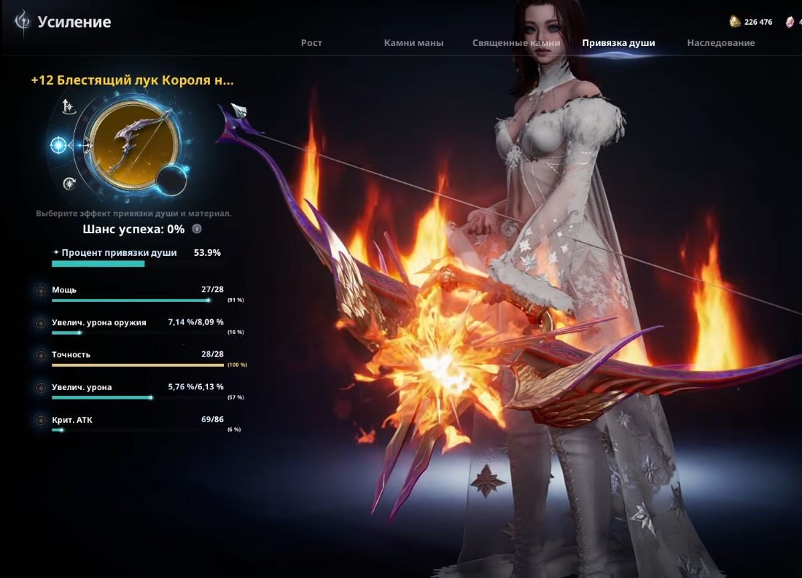

Привязка души: пять отдельных шкал характеристик и поле выбора материала для следующей попытки.

### Проверь создание наследования перед заменой оружия

[Момент в видео](https://www.youtube.com/watch?v=hUk7jO3jUdw&t=1345s)

**Где открыть:** Создание наследования → Ювелирное дело → Лук

Автор показывает следующий рецепт цепочки — лук Короля тёмных драконов. В окне прямо написано, что это создание с гарантированным успехом и что уровни усиления, прорыва и привязки души переносятся в результат.

Новое снаряжение привязывается к персонажу, выполнившему создание. Если текущий лук не отображается как исходный материал, автор предлагает сначала снять его с персонажа.

«Создание наследования» и обычное «Наследование» в меню усиления — разные функции. Открывай именно ту, которая показывает нужный рецепт и будущий предмет.

В ролике нет надёжного подтверждения переноса всех остальных вложений, в частности отдельных вставленных камней. Перед подтверждением прочитай итоговый предмет и условия переноса в текущем клиенте. Дальнейшие предметы цепочки не означают, что все они уже доступны в твоей версии.

1. Сними исходное оружие, если рецепт его не видит.
2. Проверь, какой именно предмет будет израсходован, и все дополнительные материалы.
3. Прочитай перечисленные переносимые уровни и привязку будущего предмета.
4. Отдельно проверь судьбу вставок и иных вложений. Подтверждай только после проверки результата.

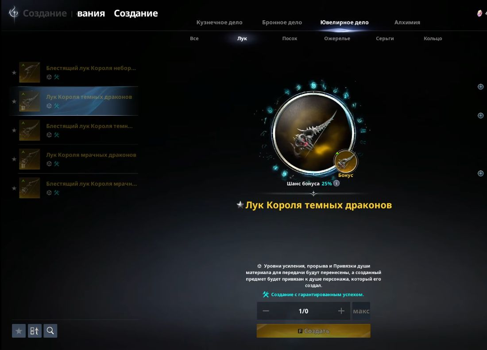

Создание наследования: гарантированный успех и перечисление переносимых уровней написаны в самом рецепте.

## 04. Арканы: полезный навык и случайные эффекты

Выбери приоритет своего класса; не превращай случайный результат в обязательный шаг маршрута.

### Что именно выбирается при синтезе

[Момент в видео](https://www.youtube.com/watch?v=hUk7jO3jUdw&t=657s)

**Где открыть:** Арканы → Синтез

Автор показывает золотую аркану «Грааль жизни» и выбирает дополнительный уровень «Скоростной стрельбы». Интерфейс предупреждает: остальные три дополнительных эффекта случайные. Выбор одного нужного навыка не гарантирует идеальный набор всех строк.

Для своего лучника автор также выделяет «Прицельный выстрел». Новичку другого класса сначала нужно определить полезные навыки своего билда. Просто повторить приоритет лучника для всех классов нельзя.

Перед синтезом открой текущий рецепт: проверь число кристаллов, валюту, ограничения и время следующей доступной попытки. Автор говорит об ограничении по времени; доступность в твоём клиенте важнее старого числа из ролика.

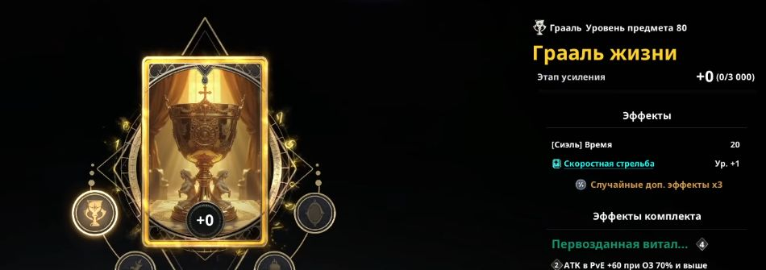

Синтез Грааля жизни: выбрана «Скоростная стрельба +1»; остальные три эффекта случайные.

### Откуда автор берёт таинственные кристаллы

[Момент в видео](https://www.youtube.com/watch?v=hUk7jO3jUdw&t=669s)

Один из показанных источников — магазин сезона, раздел «Рост», предмет «Таинственный кристалл (привяз.)». В ролике цена 25 000 сезонной валюты и отдельный лимит покупки. Сезон и цены меняются: перед обменом сверяй название и стоимость.

Сезонные очки автор получает за разные активности. Его накопленные очки — личный результат, а не стартовый запас каждого персонажа. Не трать их, пока не сравнил полезность остальных доступных наград.

Также он называет награды за очковые рубежи «Битвы пробуждения» и «Святилище ненависти». Не обещай себе кристалл после каждого прохода: посмотри конкретные рубежи и уже полученные награды.

Если нужная активность открывается только на более высоком GS, это источник для дальнейшего развития после открытия. Её награду нельзя считать обязательным способом получить доступ к ней самой.

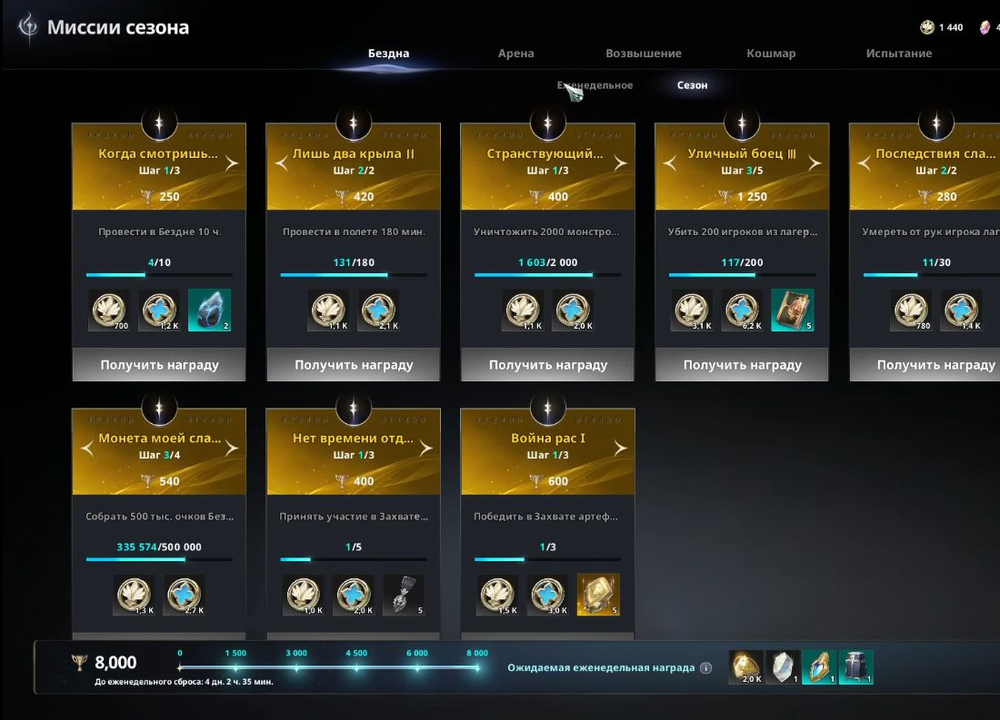

Миссии сезона: сезонная валюта и прогресс зависят от выполненных активностей. Это не экран покупки кристалла.

### Не путай извлечение с синтезом

[Момент в видео](https://www.youtube.com/watch?v=hUk7jO3jUdw&t=728s)

**Где открыть:** Арканы → Извлечение

В отдельном окне автор выбирает аркану для извлечения. Рядом с кристаллом отображается индикатор 2%. По этому кадру нельзя объявлять, что одна аркана сразу даёт целый кристалл или что это «2% шанс выпадения».

Прочитай подсказку шкалы и будущего результата в своём клиенте до подтверждения. Учитывай, что выбранная аркана будет использована в извлечении. Сначала исключи те карты, которые нужны твоему билду, комплекту или текущим уровням навыков.

Не смешивай ресурсы разных сезонов и качества: сходная форма кристалла не означает, что любой из них подойдёт к выбранному синтезу.

**Что подтверждено кадром.** Видны выбранная карта и индикатор 2%. Полное правило заполнения шкалы в этой части ролика не раскрыто; гайд не выдаёт его за установленную вероятность.

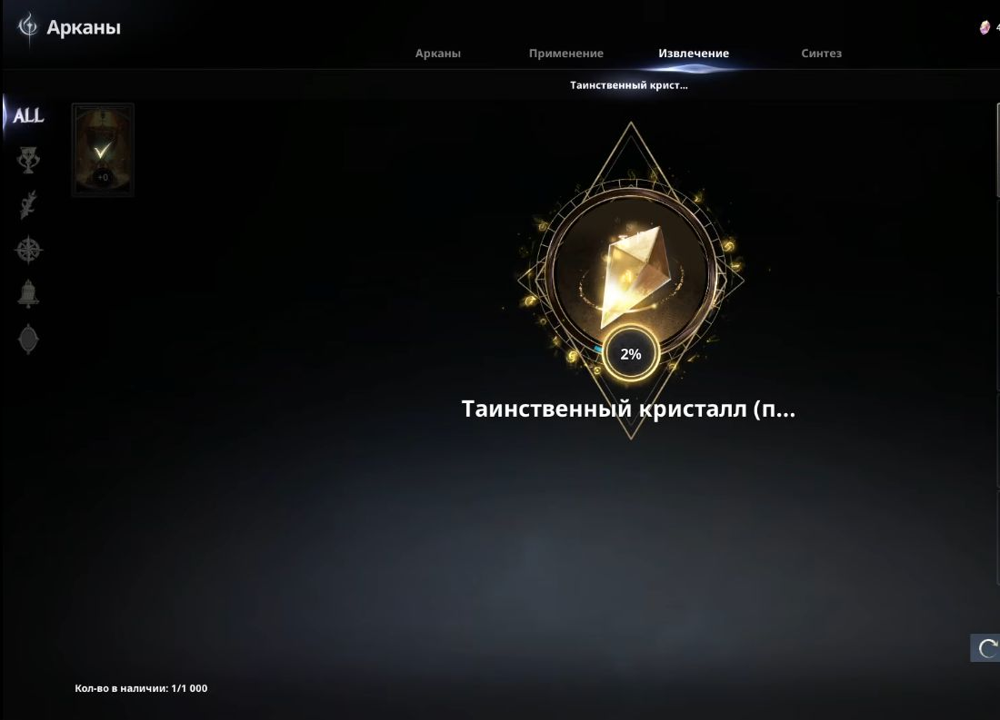

Окно извлечения аркан: выбранная карта и индикатор 2% рядом с кристаллом.

## 05. Энергия: четыре отдельных лимита

Разделяй магазин и преобразование, квоты сервера и персонажа.

### Покупка эфирной энергии в магазине

[Момент в видео](https://www.youtube.com/watch?v=hUk7jO3jUdw&t=1836s)

**Где открыть:** Магазин → Гильдия бриза → Специальное

В магазине стоят два предложения с похожими значками. У одного лимит 16 покупок в неделю на сервер, у другого — 4 на персонажа. На показанном экране цена каждой покупки 100 000 кинары.

Серверная квота общая для персонажей соответствующего сервера. Покупка на другом персонаже не создаёт ещё один независимый запас из 16. Персонажная квота относится к конкретному персонажу.

Отличай общий недельный лимит от оставшегося количества. Если видишь меньшую цифру, часть квоты могла быть уже использована. Цены и правила проверяй по своему магазину.

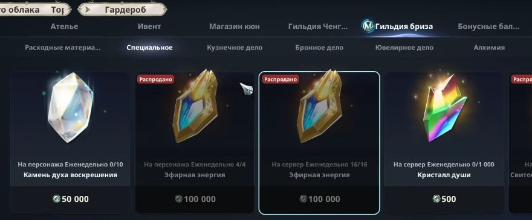

Два предложения энергии: 16 покупок на сервер и 4 на персонажа, по 100 000 кинары на показанном экране.

### Преобразование энергии: свой набор ресурсов и свои квоты

[Момент в видео](https://www.youtube.com/watch?v=hUk7jO3jUdw&t=1875s)

**Где открыть:** Преобразование веществ → Специальное / Все

Автор выбирает «Эфирную энергию (привяз.)». Для одной показанной операции требуется 25 эфира, 5 эфира высокой чистоты, 1 чистый эфир и 50 000 кинары (общ.). Шанс на экране 100%.

Это три разных качества эфира, а не 31 единица одного предмета. Проверь точные названия в каждой ячейке. Расходы на покупку материалов добавляются к плате за преобразование.

В меню есть два рецепта с одинаковым результатом: серверный и персонажный. Их лимиты отдельны от магазинных. В показанных подсказках сброс указан на среду, 09:00 по времени интерфейса; не считай это автоматически своим местным временем.

| Источник | На кого действует | Показанный лимит / неделя |
| --- | --- | --- |
| Магазин | Сервер | 16 |
| Магазин | Персонаж | 4 |
| Преобразование | Сервер | 16 |
| Преобразование | Персонаж | 4 |

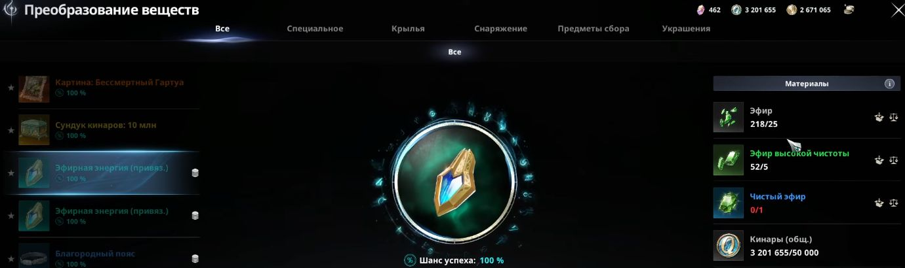

Серверный рецепт: 25 обычного эфира + 5 высокой чистоты + 1 чистый эфир + 50 000 кинары (общ.).

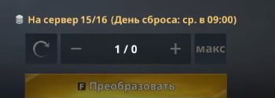

Подсказка серверной квоты преобразования: на кадре осталось 15 из 16.

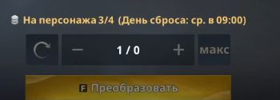

Отдельная персонажная квота преобразования: на кадре осталось 3 из 4.

### Дополнительные источники и реальный темп игры

[Момент в видео](https://www.youtube.com/watch?v=hUk7jO3jUdw&t=1890s)

Автор показывает пропуск «Зов мира» с базовой и премиальной дорожками. Премиальная дорожка — дополнительный платный вариант. Сначала проверь, на какой дорожке стоит нужная награда: открытый экран не означает, что всё на нём выдаётся бесплатно.

Сам автор получает заметную часть энергии из платного пропуска. Поэтому его темп прохождений нельзя обещать игроку, который использует только бесплатные источники.

Также в речи упоминаются скрытые кубы в мире и подходящие задания «Призвания». У каждого задания читай состав награды, а у случайной награды — вероятность. Планируй походы по запасу энергии и конкретной цели, чтобы не тратить её на уже закрытые слоты.

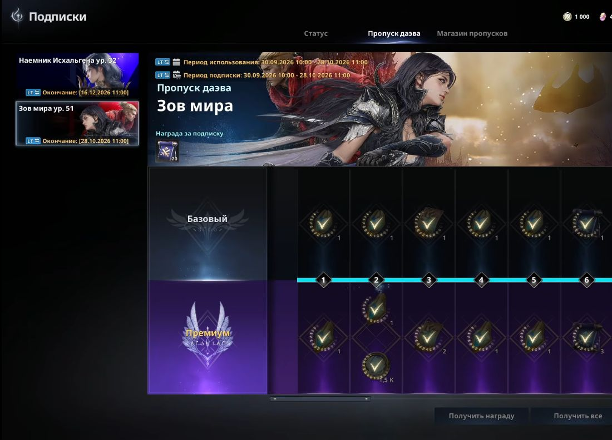

Зов мира: базовая и премиальная дорожки показаны отдельно. Проверяй, к какой относится награда.

## 06. Лучник: пример автора для PvE и PvP

Две встроенные связки навыков и ручное управление контролем. Билд автора ещё не завершён.

### PvE: четыре навыка во встроенной связке

[Момент в видео](https://www.youtube.com/watch?v=hUk7jO3jUdw&t=1479s)

**Где открыть:** Умения → Связи умений

В показанном клиенте автор открывает встроенные «Связи умений». Порядок в его списке: «Меткий выстрел», «Поддерживающий огонь», «Шквал стрел», «Опутывающий выстрел». Напротив каждого стоит задержка 10 мс.

Скриншот показывает состав и порядок списка, но не доказывает, что игра всегда исполняет его как жёсткую последовательность независимо от готовности навыков. Не добавляй к этой схеме внешнее автоматическое удержание клавиш.

Движение, защитные кнопки и ситуационные действия оставь доступными отдельно. Сначала проверь связку на обычной цели и убедись, что можешь вовремя уклониться или прервать свои действия.

Автор старается поднять «Скоростную стрельбу» и «Прицельный выстрел» до 16 с учётом бонусов. Итоговое число на иконке может включать арканы и экипировку — это не всегда столько же очков, вложенных вручную.

1. Создай отдельную PvE-связку во встроенном меню клиента.
2. Добавь четыре навыка в порядке, видимом на скриншоте.
3. Укажи показанные задержки 10 мс, если твоя версия меню поддерживает их.
4. Назначь удобную кнопку и проверь поведение вне опасного боя. Не смешивай эту настройку с интерфейсом другого видео или другой версии клиента.

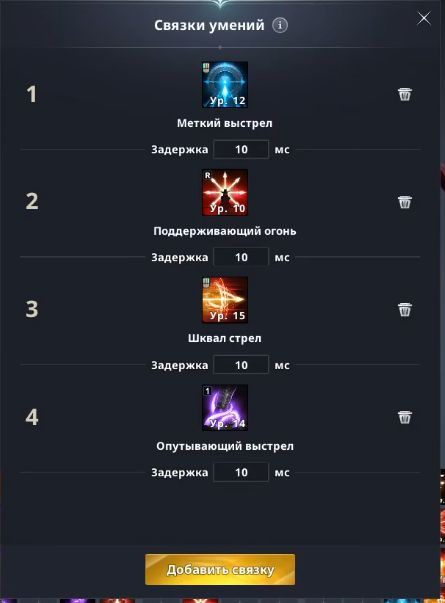

PvE-связка автора крупно: четыре названия и задержки 10 мс. Нажми, чтобы увеличить.

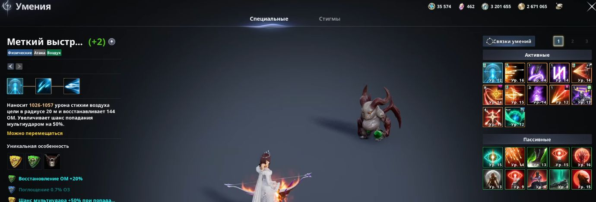

Сетка навыков автора: числа на иконках — показанные итоговые уровни, а не универсальный план распределения очков.

### PvP: короткая связка, контроль вручную

[Момент в видео](https://www.youtube.com/watch?v=hUk7jO3jUdw&t=1593s)

Для PvP автор оставляет в связке только «Меткий выстрел» и «Шквал стрел», также по 10 мс. Контроль он нажимает вручную, чтобы выбирать момент, цель и положение персонажа.

Это его текущий незавершённый билд, а не доказанная лучшая сборка для любого противника. Эффекты на скриншотах зависят от показанного уровня навыков и бонусов персонажа.

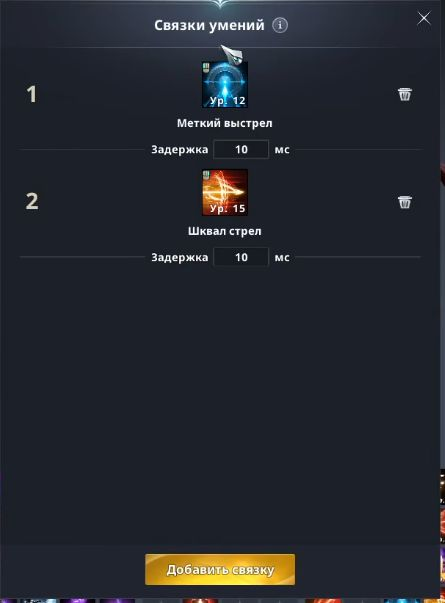

PvP-связка автора: Меткий выстрел → Шквал стрел, обе задержки 10 мс.

### Какие ручные кнопки он показывает

[Момент в видео](https://www.youtube.com/watch?v=hUk7jO3jUdw&t=1605s)

«Стрела печати», уровень 15: в подсказке показан шанс 75% наложить печать на 7 секунд и 50% обездвижить на 5 секунд. Упоминание гарантированного эффекта относится к NPC; переносить его на PvP нельзя.

«Капкан», уровень 10: показаны удержание в воздухе на 3 секунды, до четырёх целей в радиусе 5 метров и снятие до двух магических усилений. Некоторые усиления снять нельзя. Это не обещание убрать все положительные эффекты противника.

«Внезапный толчок»: автор показывает движение к позиции за целью в пределах указанной дистанции, отбрасывание и последующее отступление. Проверь своё положение и путь отхода; не воспринимай движение как всегда безопасное.

«Иллюзорная стрела»: на показанном уровне ослепление на 4 секунды. Перед использованием проверяй готовность навыка и эффект на противнике, а не только порядок кнопок из ролика.

| Кнопка | Что проверять перед нажатием |
| --- | --- |
| Стрела печати | Нужен ли контроль сейчас; эффект в PvP не гарантирован |
| Капкан | Позиция целей и снимаемые магические усиления |
| Внезапный толчок | Дистанция до цели и безопасное место после движения |
| Иллюзорная стрела | Готовность навыка и подходящий момент для ослепления |

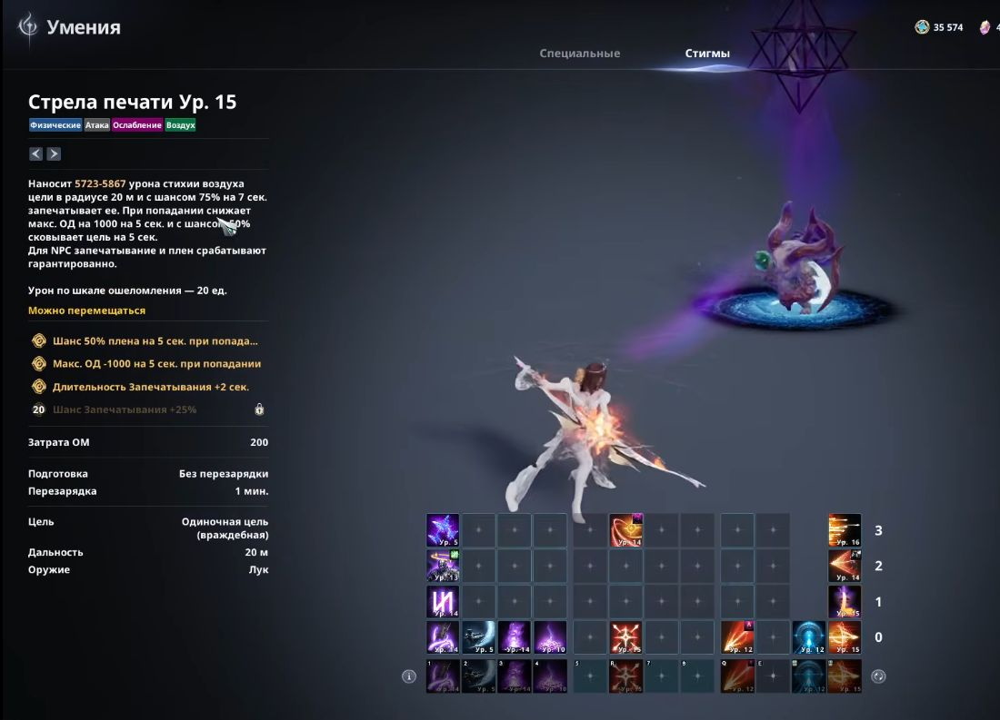

Стрела печати: отдельно указаны вероятности для игрока и гарантированный эффект для NPC.

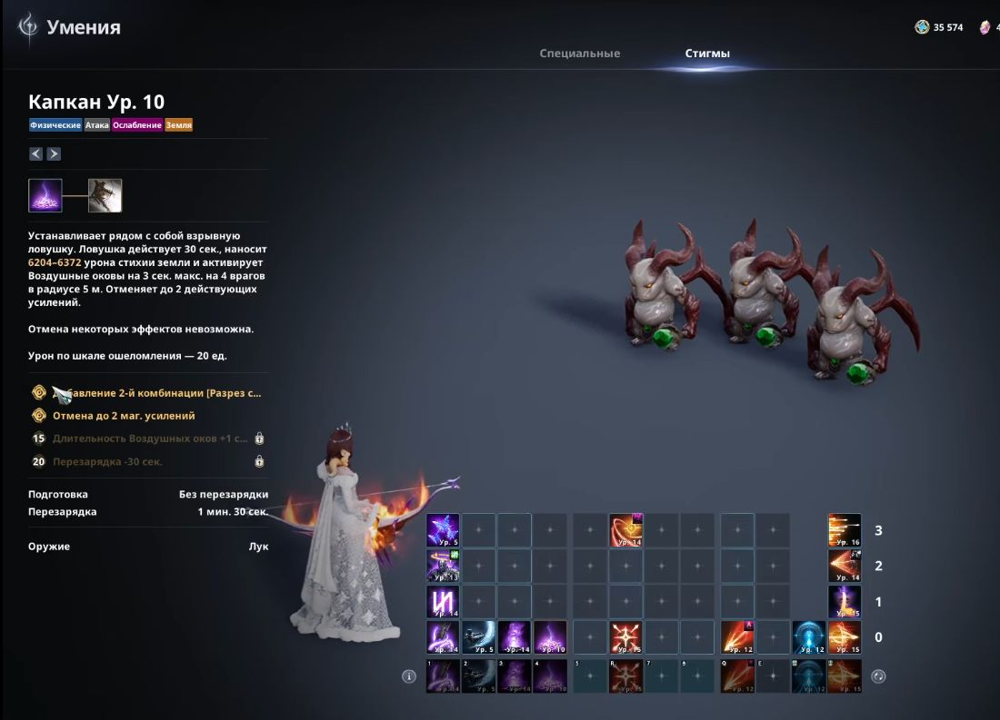

Капкан: удержание в воздухе и снятие до двух магических усилений.

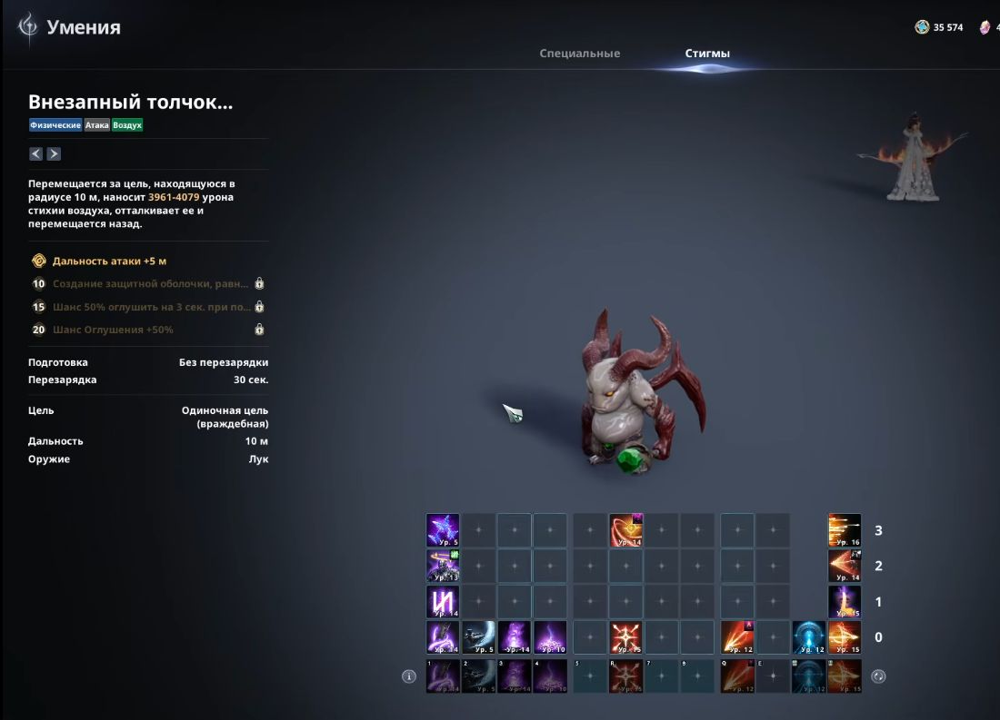

Внезапный толчок: подсказка перемещения и дистанции.

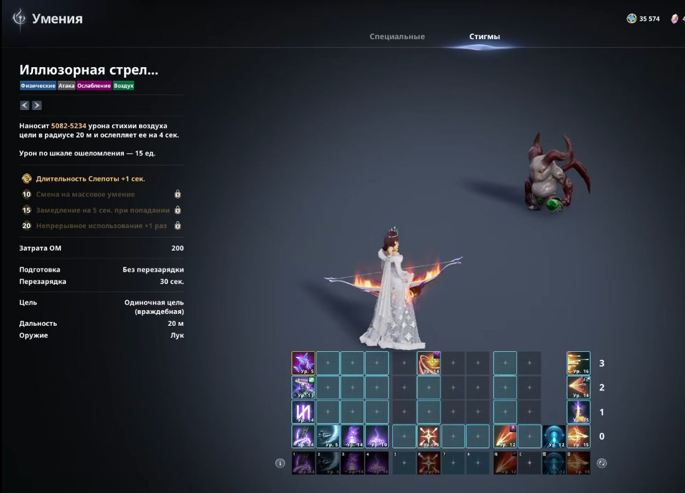

Иллюзорная стрела: подсказка ослепления и времени восстановления.

### Стигмы и приоритеты — под свой набор

[Момент в видео](https://www.youtube.com/watch?v=hUk7jO3jUdw&t=1785s)

Автор связывает развитие стигм с очками Бездны и рассказывает о своих промежуточных уровнях. В этой части нет полного пошагового показа магазина и однозначного списка всех выбранных стигм, поэтому гайд не дорисовывает отсутствующую конфигурацию.

Для своей настройки открой описание стигмы, проверь её назначение в PvE или PvP и доступный ресурс. Сначала доведи важные для твоего набора умения до нужного эффекта, затем оцени стоимость дальнейших уровней.

Не копируй итоговые уровни и раскладку без учёта аркан, экипировки и своего режима игры. Возвращайся к настройке после смены значимого предмета или навыка.

**Что осталось личным мнением автора.** Оптимальность всего билда, будущие предметы и универсальный прирост урона не подтверждены роликом. Здесь сохранены показанные действия и названия, а рекомендации подписаны как его пример.
